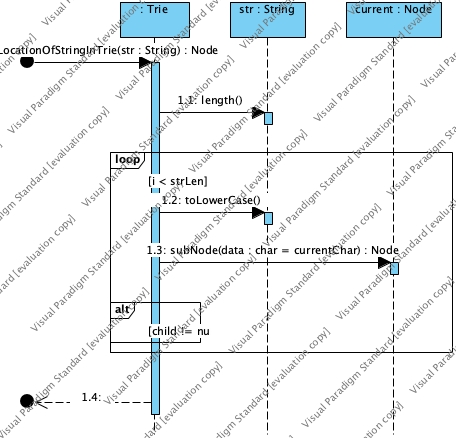

### Application to provide auto suggestions for given query string

#### Running the application

The Application reads [input.txt](./input.txt) and writes output to [output.txt](./output.txt)

#### Design

The application uses [Trie](https://en.wikipedia.org/wiki/Trie) data structure to store each character of 
input string. [Trie](https://en.wikipedia.org/wiki/Trie) helps faster retrieval of
suggestion word for given prefix.

##### Below is class diagram

##### Below is sequence diagram for adding word to Trie data structure

##### Below is sequence diagram for getting suggestion for given query string

##### Below is sequence diagram for adding of nodes in Trie data structure

##### Below is sequence diagram for searching node for given query string
